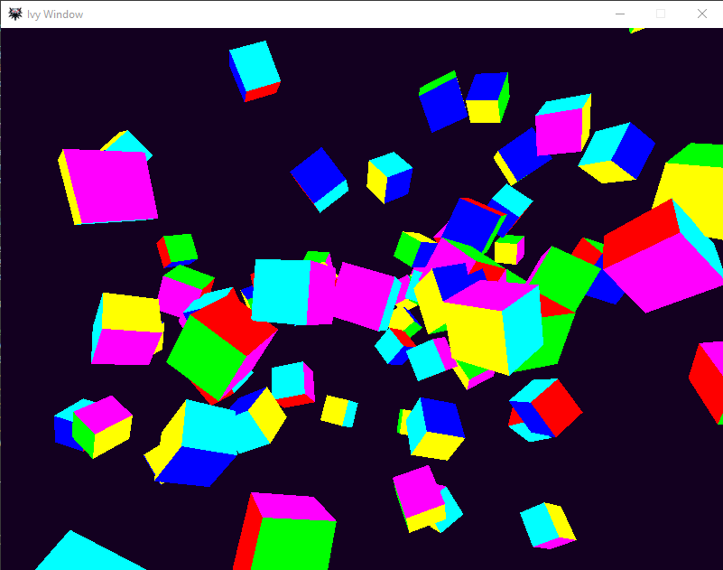

# HW3D_2020
## A record of my progress in reverse chronological order
### Test Scene after Architecture Rework

### First 3D scene with two cubes and a simple depth stencil to allow oclusion

### First window and triangle render with simple Vertex and Pixel Shaders

### *Project based off of ChiliTomatoNoodle tutorials*
